# 市场战略及资源配置分析平台

> **Sales Strategy & Operations Analytics Platform** — 面向金融类企业管理层的分析平台

基于公司营收、部门经营数据、地方财政及债券市场数据，此平台构建了业绩市场版图概览、省域四象限攻守战略分析（打哪里）、成交模式分析（怎么打）、市场人员作战画像（谁去打）以及部门人效分析等核心模块，为市场战略制定与资源配置提供决策依据。

A sales strategy and operations analytics platform for financial enterprises. The platform integrates company revenue, departmental financials, and regional fiscal data to deliver actionable insights across provincial strategic positioning (where to compete), deal pattern analysis (how to win), personnel deployment (who to send), and departmental workforce efficiency (cost & productivity).

## 目录

- [项目定位](#项目定位)
- [项目结构](#项目结构)
- [功能模块目录](#功能模块目录)
- [亮点模块详情](#亮点模块详情)
- [快速开始](#快速开始)
- [技术栈](#技术栈)

## 项目定位

- 本项目基于信用评级机构的真实业务场景构建，可拓展到金融类企业的市场战略及资源配置分析。
- 本项目目前为MVP，采用单文件 Streamlit 轻量化交付。

  - **数据源**：公司到款明细 + 部门收入费用明细 + 全国各省财力数据及债券数据
  - **交付物**：Streamlit 交互看板，主要供管理层、战略部门、业务部门使用
- 在常规业绩分析与部门人效分析的基础上，本项目进一步构建了以下创新模块，解决真实的公司市场战略、资源配置与人才管理问题：

  - **每个省的战略定位**：每个省的攻打战略是什么？值不值得打？我们在这里发挥出应有水平了吗？哪里该进攻、哪里该收缩、哪里正在流失机会？
  - **每个省的赚钱模式**：这个省适合高价低频的深度运营，还是低价高频的标准化覆盖？打法应该怎么设计？
  - **每个人的作战模式：** 这个市场人员在哪里作战？作战模式是怎样的？是否值得被复制或是否应该警惕？是在深耕奇迹？还是在战略攻坚？还是在空转资源？或是在低耗维持？
  - **每个人消耗的子弹：** 实时看到每个市场人员的费用是否超支，给团队领导提供异常情况预警并及时介入。

## 平台功能预览

### 全司业务概览

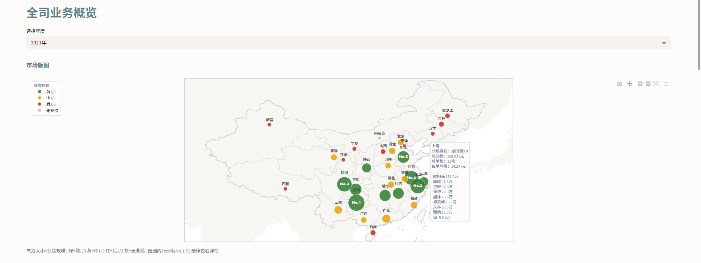

<details>
<summary>展开查看全司业务概览全部截图</summary>

[**省份排名榜及战神榜**](screenshots/全司业务概览-2省份排名榜及战神榜.png)

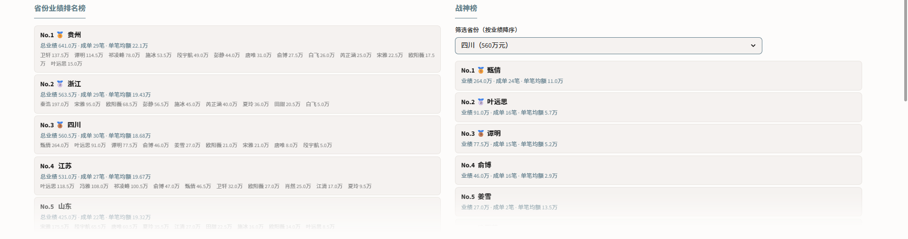

[**省域财力与业绩分析·攻守战略**](screenshots/全司业务概览-3省域财力与业绩分析·攻守战略.png)

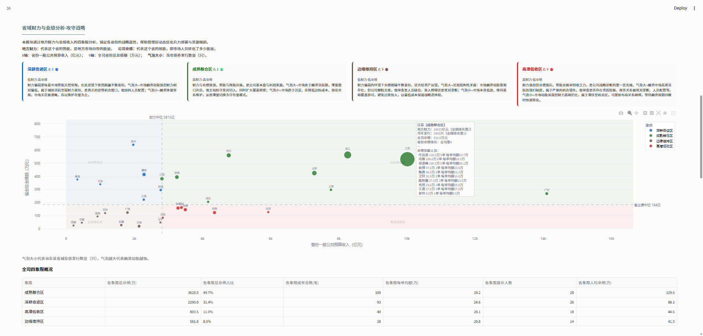

[**省域成交模式分析·攻打战术**](screenshots/全司业务概览-4省域成交模式分析·攻打战术-参数设定.png)

参数设定模式：

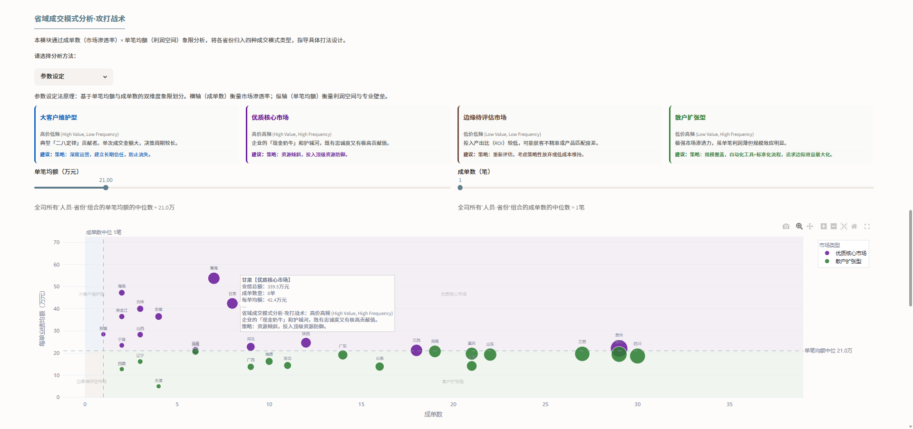
聚类分析模式：

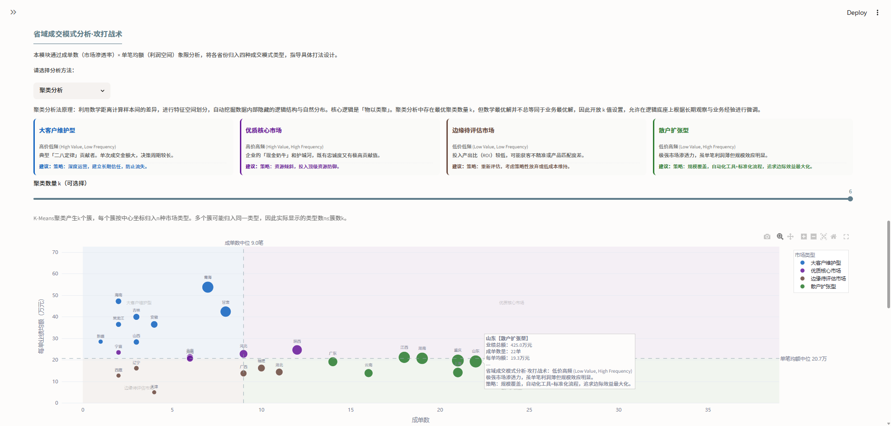

[**市场人员作战画像分析**](screenshots/全司业务概览-5市场人员作战画像分析-全部人员.png)

全部人员视图：

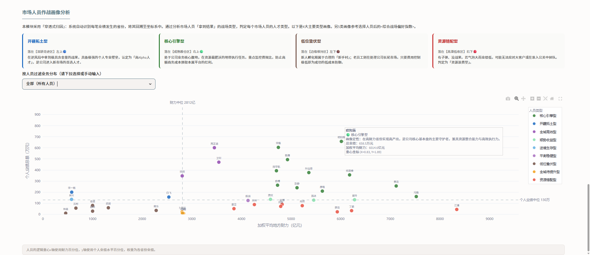
筛选单个人员视图：

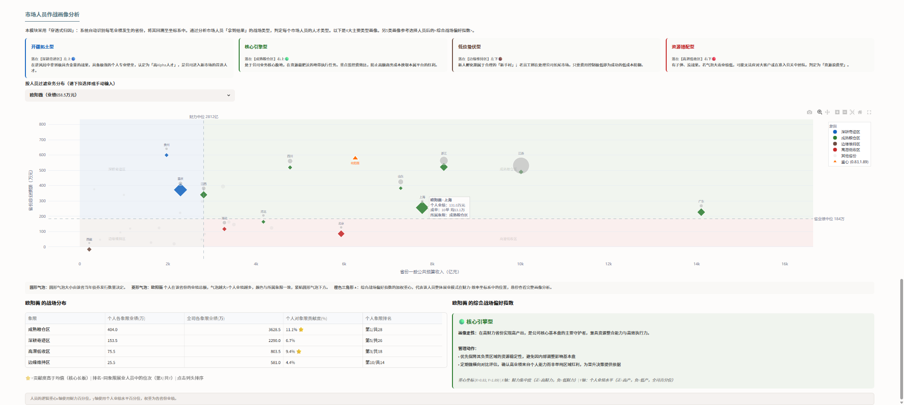

</details>

### 部门人效分析

<details>
<summary>展开查看部门人效分析全部截图</summary>

[**部门效能总览及人员业绩费用对比**](screenshots/部门人效分析-1部门效能总览及人员业绩费用对比.png)

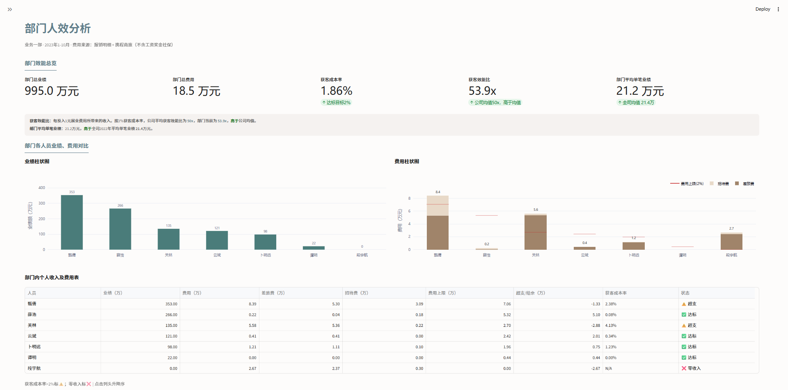

[**合作关系分析**](screenshots/部门人效分析-2合作关系分析.png)

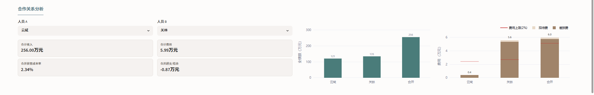

[**人员费效象限分析**](screenshots/部门人效分析-3人员费效象限分析.png)

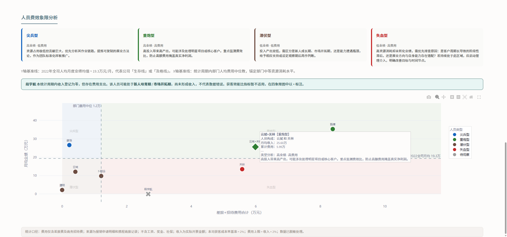

</details>

## 项目结构

```
.
├── .streamlit/
│   └── config.toml              # Streamlit 主题配置
├── data/                        # 数据文件（公司数据已脱敏处理）
│   ├── 业务一部收入明细（2023年1-10月）.xlsx
│   ├── 业务一部报销明细（2023年1-10月）.xlsx
│   ├── 业务一部携程商旅明细（2023年1-10月）.xlsx
│   ├── 全司到款明细（2021-2022）.xlsx
│   ├── 全国各省财力及债券数据（2021-2022）.xlsx
│   ├── china_country_geo.json   # 地图渲染（国界）
│   └── china_provinces_geo.json # 地图渲染（省界）
├── screenshots/                 # 项目每个功能模块 截图
├── main.py                      # Streamlit 应用入口（单文件架构）
├── requirements.txt
└── README.md
```

> **数据说明**：4个公司数据文件均为参照真实业务场景构造的虚拟数据，仅用于展示本项目的分析逻辑。1个财力数据文件和2个地图文件源于公开数据。

## 功能模块目录

Streamlit网页中含有两个模块切换，模块一为全司业务概览，模块二为部门人效分析，分布及功能如下。

```
.
├── 模块一：全司业务概览
│   ├── 1. 市场版图                           地图热力气泡图，各省年度业绩分布
│   ├── 2. 省份业绩排名榜 / 战神榜             多年度切换滚动排名，战神榜可按省份筛选
│   ├── 3. 省域财力与业绩分析·攻守战略            每个省的攻守战略是什么？值不值得打？详见亮点模块
│   │   ├── 深耕奇迹区（左上·低财力高业绩）     — 逆势超额转化，能力驱动型增长
│   │   ├── 成熟粮仓区（右上·高财力高业绩）     — 基本盘守护，势能驱动型增长
│   │   ├── 边缘维持区（左下·低财力低业绩）     — 轻资产运营，保留战略选择权
│   │   └── 高潜低收区（右下·高财力低业绩）     — 机会错失预警，战略诊断第一优先级
│   ├── 4. 省域成交模式分析·攻打战术            每个省的赚钱模式是什么，具体怎么打？详见亮点模块
│   │   ├── 优质核心市场（高价高频）           — 资源倾斜防御
│   │   ├── 大客户维护型（高价低频）           — 深度运营
│   │   ├── 散户扩张型（低价高频）             — 标准化流程
│   │   └── 边缘待评估市场（低价低频）         — 减少资源投放
│   └── 5. 市场人员作战画像分析                分析每个市场人员的作战模式，怎么排兵布阵？详见亮点模块
│       ├── 基础版：四大人员画像
│       │   ├── 开疆拓土型（深耕奇迹区·高Alpha）    — 逆势开拓，不吃环境红利的非对称竞争力
│       │   ├── 核心引擎型（成熟粮仓区·基本盘）     — 高财力高产出的中坚力量
│       │   ├── 低位蛰伏型（边缘维持区·低成本防御） — 新人成长期或老兵防守配置
│       │   ├── 资源错配型（高潜低收区·预警信号）   — 肥田薄收，人岗匹配或商务关系排查
│       └── 进阶版：人员的综合战场偏好指数及每个象限的业绩贡献等等
│         ├── 按人员过滤业务分布，选择全部（所有人员）后显示全司所有人员的人才画像。
│         └── 按人员过滤业务分布，选择人员后图表显示该人员业绩所在的省份，并显示该人员的综合战场偏好指数。
└── 模块二：部门人效分析     
    ├── 1. 部门效能总览                       部门KPI实时追踪，对标 2% 获客成本率红线
    ├── 2. 人员业绩与费用对比                  部门内所有市场人员横向对比柱状图 + 明细表
    ├── 3. 合作关系分析                       业绩贡献 / 费用分摊 / 超支 / 获客成本率
    └── 4. 人员费效象限分析                   费用中位数 × 月均业绩四象限人员分类，给团队领导提供实时预警
        ├── 尖兵型（左上）                  — 高业绩低费用，分析作业链路
        ├── 重炮型（右上）                  — 高投入高产出，监测费效比
        ├── 潜伏型（左下）                  — 低投入低产出，支持/观察
        └── 失血型（右下）                  — 高耗资源未转化，人员预警
```

## 三大亮点模块

```
战略层 ── 省域财力与业绩分析·攻守战略
  │     打哪里？哪些省值得投入、哪些该收缩
  │     财力中位 × 省业绩中位 → 四象限攻守定位
  │
  ▼
战术层 ── 省域成交模式分析·攻打战术
  │     怎么打？这个省适合大客户维护还是流线型扩张
  │     成单数中位 × 单笔均额中位 → 四种交易打法
  │
  ▼
执行层 ── 市场人员作战画像分析
        谁去打？谁适合去穷省拓荒、谁该守富省粮仓
        财力偏好 × 绝对产出 → 9 种人员画像
```

### 模块1：省域财力与业绩分析·攻守战略（打哪里 · 战略层）

#### 解决的核心问题：

这个省的攻守战略是什么？值不值得打？我们在这里发挥出应有水平了吗？通过地方财力与业绩收入的四象限分析，锚定各省份的战略属性，帮助管理层动态优化兵力部署与资源倾斜。

#### 为什么选择「业绩」与「财力」作为双轴：

- 财力（势能Potency）：地方全级一般公共预算收入，代表市场自带的能量——蛋糕有多大、钱往哪流，是我们无法改变的外部禀赋。
- 业绩（效能Performance）：公司在该省的业绩收入，代表团队将市场能量转化为生意的能力——同样的蛋糕，我们切到了多少。

两者交叉，回答最核心的问题：这个市场是好是坏，我们在其中做得好不好。结合发行量的气泡分析，可以进一步明确攻守策略。

#### Business Insight：

1. **识别各个省份的作战模式：** 通过四象限定位各省战略属性——🔵深耕奇迹区、🟢成熟粮仓区、🔴高潜低收区、🟤边缘维持区，为每个省份匹配差异化作战策略，避免用同一套打法对待截然不同的市场环境。
2. **识别公司目前的收入驱动类型：**

- 如果公司的业绩分布以🔵深耕奇迹区为主，说明增长属于**能力驱动型**，人员能动性是核心变量，需警惕市场天花板。
- 如果以🟢成熟粮仓区为主，则属于**势能驱动型**，公司正处于平台红利期，需警惕红利消退后的增长惯性依赖。
- 如果以🔴高潜低收区为主，则属于**机会错失型**，公司整体坐拥优质市场却系统性转化失效，需立即审查是准入壁垒、商务关系断层还是兵力配置失当，是当前最紧迫的战略修复信号。
- 如果以🟤边缘维持区为主，则属于**战略收缩型**，公司业绩重心集中于弱势市场，整体增长空间天然受限。需评估是否应主动向高财力省份迁移资源重心，寻找下一个增长极。

3. **动态监测"陪跑风险"与"错失红利"：** 气泡大小（发行量）是实时警报。🔴高潜低收区出现大气泡是严重警示——当地钱多、融资市场高度活跃，我们却严重缺席，管理层可据此立即排查：①是否存在准入壁垒或资质短板；②商务关系是否断层或被竞对垄断。③是否人员配置不足或能力不匹配。
4. **优化"轻重缓急"的资源投入比例，指导管理层增兵与减负：**

- 右上🟢成熟粮仓区：若为大气泡，需预防存量客户被竞对趁乱切走，必须投入重兵主动防守。
- 左上🔵深耕奇迹区：若为大气泡，是值得重视的逆势信号——低财力省份融资活跃且我们业绩突出，管理层应立即萃取该省方法论，增强兵力。
- 右下🔴高潜低收区：若为小气泡，市场动能虽弱但财力基础仍在，属于潜伏型机会区，可提前布局关系网络，等待融资周期回暖时快速转化。
- 左下🟤边缘维持区：若为小气泡，低产出符合市场逻辑，管理层应保持战略定力，不被低业绩带偏节奏，维持低成本运行。

<details>
<summary>模块截图：省域财力与业绩分析·攻守战略 </summary>


</details>

### 模块2：省域成交模式分析·攻打战术（怎么打 · 战术层）

#### 解决的核心问题：

每个省的赚钱模式是什么？应该用高价低频的深度运营，还是低价高频的标准化覆盖？通过成单数（市场渗透率）× 单笔均额（利润空间）象限分析，将各省份归入四种成交模式类型，指导具体打法设计。

#### Business Insight：

1. **识别各省的赚钱模式差异：** 同样是高业绩省，有的靠"大客户深度挖掘"（高价低频），有的靠"散户规模覆盖"（低价高频），打法截然不同。该模块为每个省匹配差异化的展业策略，避免一刀切。
2. **发现结构性问题：** 若某省高财力但成交模式呈低价低频（边缘待评估市场），说明市场存在但渗透方式有误——可能是产品定价错配、客户定位偏差或商务流程断层。

#### 两种分析模式（将数学最优解与业务经验结合）：

- 聚类分析（K-Means）：自动挖掘数据内部隐藏的结构分布，支持调整聚类数量 k（2-6）。
- 参数设定：基于单笔均额中位数 × 成单数中位数手动划定象限中线，适合有明确管理标准的场景。

<details>
<summary> <b>模块截图：参数设定 / 聚类分析 </b></summary>
<br>
参数设定模式:


聚类分析模式：


</details>

### 模块3：市场人员作战画像分析（谁去打 · 执行层）

#### 解决的核心问题：

这个市场人员在哪里作战？作战战绩如何？作战模式是怎样的？是否值得被复制或是否应该警惕？采用“穿透式归因”逻辑，将个人业绩还原至其真实的作业背景中，为人才盘点、人岗匹配及激励机制提供决策依据。

#### Business Insight：

1. **识别真正的 Alpha 型人才：** 通过穿透归因，管理层能一眼识别出开疆拓土型人员（深耕奇迹区🔵）。该人员主动选择或长期深耕低财力省份，却实现了全司高位产出，证明其不依赖环境红利，具备极强的单兵 Alpha 能力。其展业路径（话术、产品包、客户触达方式）是公司最应标准化复制的"作战算法"，也是进入新市场的首选人才储备。
2. **预判人才的"环境迁移风险"** ：身处成熟粮仓区🟢的高产人员是公司现金流的核心，其当前业绩无需质疑。 但管理层需要前瞻性地思考：若该省份财政收缩、或该人员需要跨区调动， 其业绩是否会随环境变化而断崖？ 结合其在低财力省份的历史战绩，纵向时间对比（省份整体市场好的年份他业绩高，市场差的年份业绩也跟着跌）以及同省份人员的横向对比，可判断其产出中"个人能力"与"平台红利"各占几成， 为继任规划与区域战略调整提供决策依据。
3. **精准定位“人岗错配”的损耗点：** 若某人身处高财力、高增量（气泡大）的省份，却仅拿到极少业绩（落在资源错配区🔴），说明其在该地的渗透效率严重低于预期，错失了当地大规模融资的红利窗口。管理层可据此追问：是勤奋问题、客情断层，还是产品颗粒度错配？例如某人擅长小城投业务，却被派驻至以高门槛大主体为主的省份，导致能力与战场严重不匹配。该模块为更科学的人事调动提供数据依据。
4. **建立“新人成长”与“老人倦怠”的预警系统：** 针对位于“低财力低业绩”区域（边缘维持区🟤）的情况，区别分析：

- 若是新人，低产出属于正常起步磨炼期，重点观察其费用控制与成长斜率
- 若是老兵，需结合多年度数据对比：当外部气泡（融资机会）持续扩大而其业绩纹丝不动时，可预判为"职业倦怠"或能力触顶，应提前启动人才梯队更迭，避免被动失守

#### 进阶设计：计算每个市场人员的“综合战场偏好指数”

在个人战场分布表下方，系统根据每个市场人员每个省份业绩加权计算一个“综合战场偏好指数”，自动输出其展业模式的底层画像。在四象限中，如果说“左右”决定了人员的战场偏好，那么“上下”就决定了人员的执行效率。设置原点缓冲区，半径R=0.25，允许重心在原点附近的合理范围内归入平衡型。我们将重心坐标 (X, Y) 的组合划分为以下 9 种人员画像分类。

```
.
└── 9类人员坐标画像分类
    ├── 一、落在某一象限（|X|>R 且 |Y|>R）
    │   ├── X<-R, Y>R    开疆拓土型    — 深耕奇迹区｜主动选择低财力省份却实现全司高位产出，极具非对称竞争优势。
    │   ├── X>R,  Y>R    核心引擎型    — 成熟粮仓区｜维护核心基本盘的中坚力量，是公司现金流的绝对核心，关注费效比
    │   ├── X<-R, Y<-R   低位蛰伏型    — 边缘维持区｜若是新人可能在成长期，若是老兵为防守配置，维持低成本投入闭环
    │   └── X>R,  Y<-R   资源错配型    — 高潜低收区｜最严重预警，肥沃土地颗粒无收，强制审计原因
    │
    ├── 二、落在某轴附近（|X|≤R 或 |Y|≤R，且在圆外）
    │   ├── |X|≤R, Y>R    全域高效型   — 业绩重心偏上。展业模式通用性极强，不挑环境，具备极强的客户斩获力
    │   ├── |X|≤R, Y<-R   全域待提升型 — 业绩重心偏下。无论财政条件优劣，个人绝对产出持续处于全司低位，需排查问题
    │   ├── X<-R, |Y|≤R   逆境生存型   — 业绩重心偏左。低财力区域展业，业绩接近均值，具备逆境作战韧性，竞争优势待形成
    │   └── X>R,  |Y|≤R   顺势收益型   — 业绩重心偏右。高财力区域展业，业绩接近均值，产出与环境强相关，竞争优势待形成
    └── 三、落在原点附近（dist≤R，R=0.25）
        └── |X|≤R, |Y|≤R  平衡稳健型    — 战场分布均匀，有跨环境适应性，需结合业绩分布等判断是"全面开花"还是"全面平庸"
```

<details>
<summary><b>9种市场人员画像PPT说明 </b></summary>

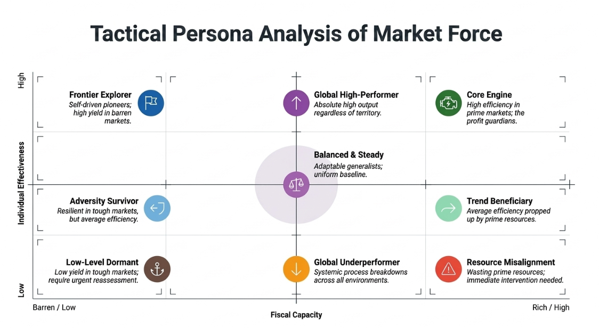

</details>

<details>
<summary> <b>模块截图：市场人员作战画像分析 </b></summary>
<br>
全员人员：


筛选单个人员：


</details>
<br>

**UI 交互设计**：

- 按人员过滤业务分布，选择全部（所有人员）后显示全司所有人员的人才画像。
- 按人员过滤业务分布，选择人员后图表显示该人员业绩所在的省份，并显示该人员的综合战场偏好指数。示例：

> **势能利用型 (Potency-Success)**
>
> **画像定性**：在资源最肥沃的「核心腹地」拿到优秀战绩。该人才是维护核心基本盘的中坚力量。
>
> **管理动作**：
> • 风险防范：警惕其产生「平台即能力」的路径依赖。
> • 审计费效比：确保高业绩源于效能而非超额商务成本堆砌。
>
> *重心坐标 (X=0.46, Y=0.64) | X轴：财力偏向（右=高财力，左=低财力）| Y轴：转化效率（上=高效，下=低效）*

<details>
<summary>模块截图：全部人员视图 / 单人员筛选视图</summary>

全部人员视图：


单人员筛选视图：


</details>

## 快速开始

**环境要求：** Python 3.11+，Windows / macOS / Linux

```bash
# 克隆项目
git clone <repo-url>
cd <project-dir>

# 创建并激活虚拟环境
python -m venv venv
# Windows:
.\venv\Scripts\Activate.ps1
# macOS / Linux:
source venv/bin/activate

# 安装依赖
pip install -r requirements.txt

# 启动 (选其一)
# 方法 1 
streamlit run main.py
# 方法 2
python -m streamlit run main.py
```

## 技术栈

| 层次       | 技术                |
| ---------- | ------------------- |
| 前端与交互 | Streamlit ≥ 1.28   |
| 可视化     | Plotly ≥ 5.17      |
| 数据处理   | Pandas ≥ 2.0       |
| 聚类算法   | scikit-learn ≥ 1.3 |

**数据流转：** 原始 Excel → Pandas 清洗与合并 → 指标计算 → Plotly 可视化 → Streamlit 交付
